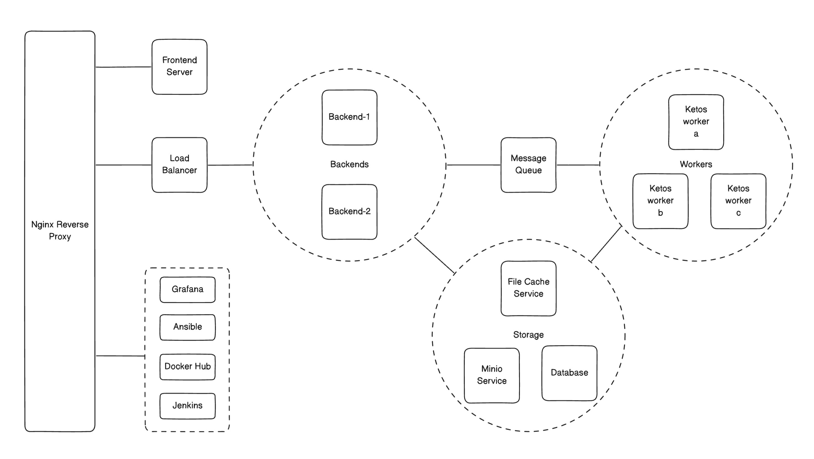

# Maipl Infrastructure

## System overview

## Components

### Minio Cluster
The development environment uses a Minio cluster for object storage. Configuration and deployment files can be found in:
- `/services/minio/` - Docker Compose and configuration files
- `/ansible/roles/minio` - Deployment playbooks
- `/terraform/modules/minio/` - Infrastructure provisioning

